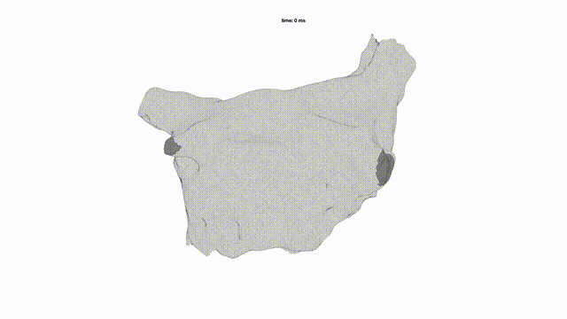

This is an electrophysiological heart simulator based on Mitchell-Schaeffer equations. I can reproduce patient-specific focal and rotor arrhythmias. 

An example of arrhythmia simulation:  

Run arrhythmia_simulation.m.  
