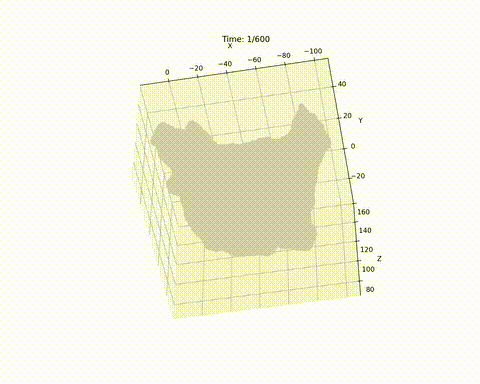
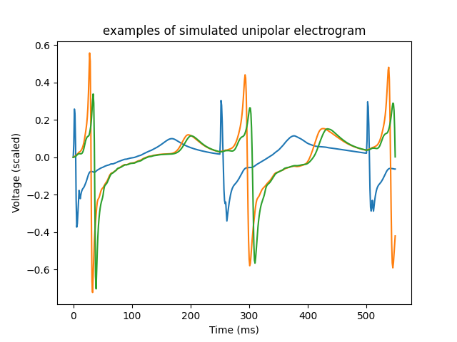

This is an electrophysiological heart simulator based on Mitchell-Schaeffer equations.  
Written in Python.  
It can reproduce patient-specific focal and rotor arrhythmias.  

An example of arrhythmia simulation:  
  

Examples of simulated action potential:  
  

Examples of simulated electrogram:  
  
